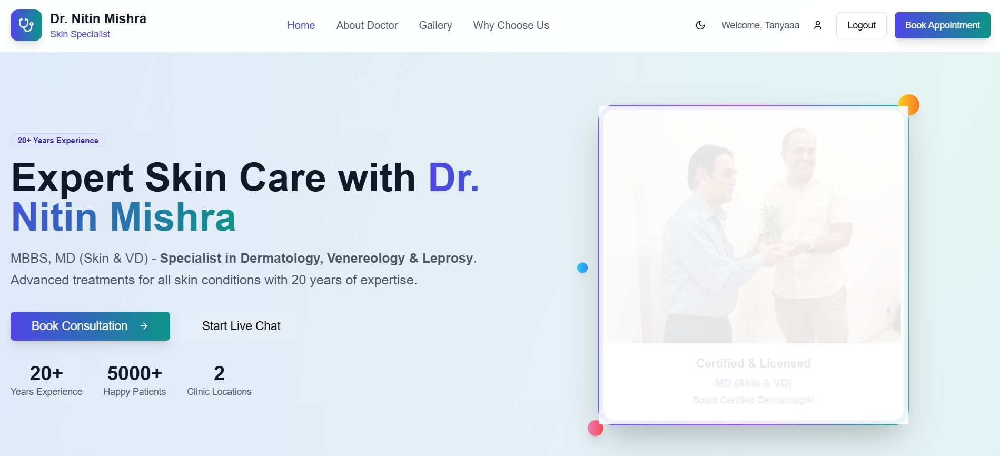
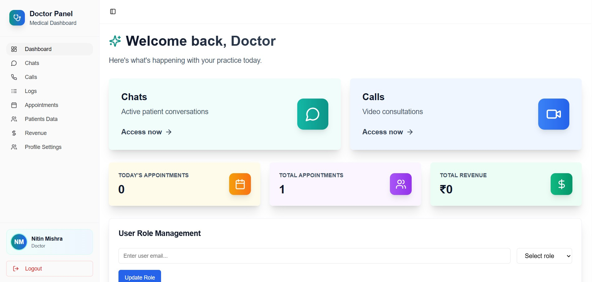
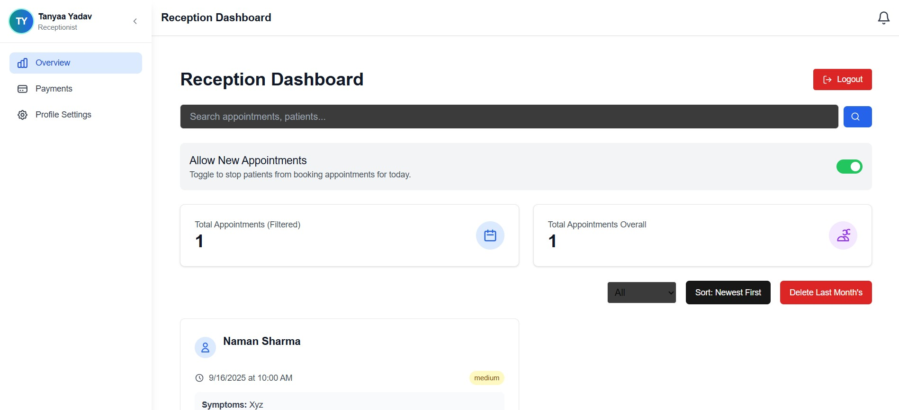
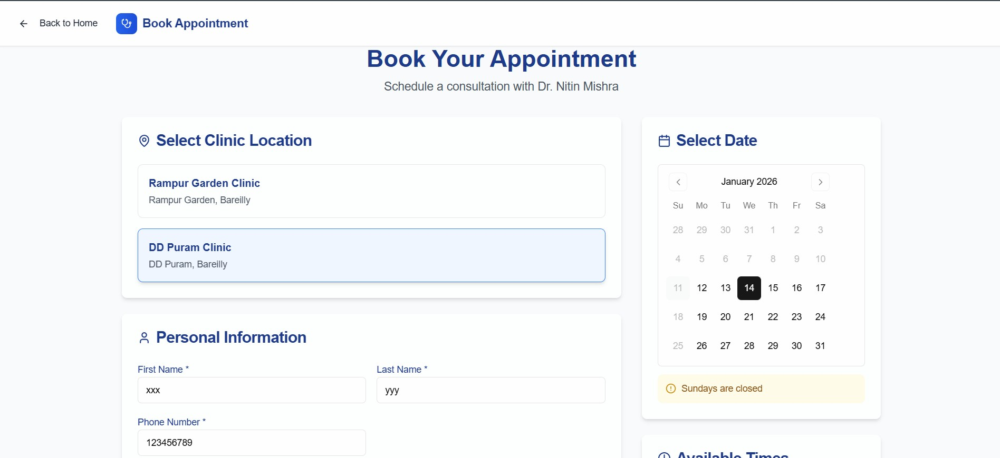
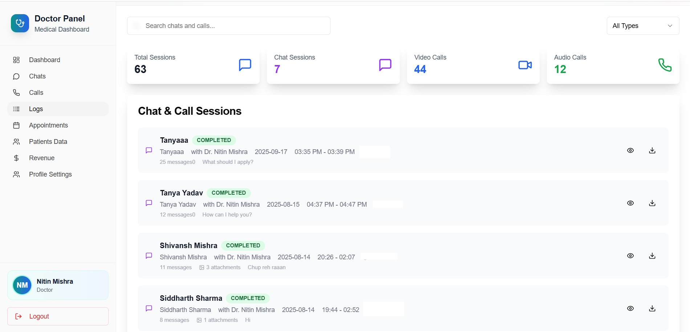

# 🩺 Doctor Consultation App

A full-stack **Doctor Consultation Web Application** designed to manage online medical consultations with clearly separated roles for **Patients, Doctors, Receptionists, and Admins**.

---

## 🚀 Features

## 👤 Patient Panel
- Book appointments by selecting clinic & time slot
- Secure login using Firebase Authentication
- Real-time video and voice consultations using Agora / WebRTC
- Secure media uploads (medical reports, prescriptions, images) during consultation
- “Please wait until doctor joins” consultation screen
- View appointment status and history

---

## 🧑‍⚕️ Doctor Panel
- View assigned patient consultations
- Join / end live consultations
- Real-time chat with patients
- Access patient details during consultation
- Simple and focused consultation interface

---

## 🧾 Receptionist Panel
- View today’s and total appointments in real time
- Sort & filter appointments (Today / Yesterday / Last Month)
- View patient details, urgency & payment status
- Delete or manage appointments
- Live notifications when a new appointment is booked

---

## 🛡️ Admin Panel
- View overall system statistics
- Manage user roles (Patient / Doctor / Receptionist / Admin)
- Monitor appointments across clinics
- Access dashboard insights (appointments, users, activity)
- Full system-level control

---

## 🧑‍🤝‍🧑 User Roles Summary

| Role          | Responsibilities |
|--------------|------------------|
| Patient       | Book appointments, chat with doctor |
| Doctor        | Conduct consultations, chat with patients |
| Receptionist  | Manage appointments & notifications |
| Admin         | System control, role management |

---

## 🛠️ Tech Stack

### Frontend
- Next.js (App Router)
- React.js
- Tailwind CSS

### Backend / Services
- Firebase Authentication
- Firebase Firestore (Real-time Database)

### Tools & Deployment
- Git & GitHub
- Vercel
- Role-based access control (RBAC)

---

## 🔐 Authentication & Authorization
- Firebase-based authentication
- Role-based access for all dashboards
- Default role: **Patient**
- Admin can update roles securely

---

## 🌐 Deployment

Deployed on Vercel
[practo-doctor-qsyp.vercel.app](practo-doctor-qsyp.vercel.app)

---

## 📌 Future Enhancements
- Payment gateway integration (Razorpay)
- SMS reminders before appointments

---

---

## 📸 Application Screenshots

### 👤 Patient Portal

### 🧑‍⚕️ Doctor Portal

### 🧾 Receptionist Portal

### 🛡️ Appointments

### 💬 Consultation Chat

### 💬 Call and Chat Logs

### 💬 Doctor Profile

⭐ If you like this project, don’t forget to star the repository!
